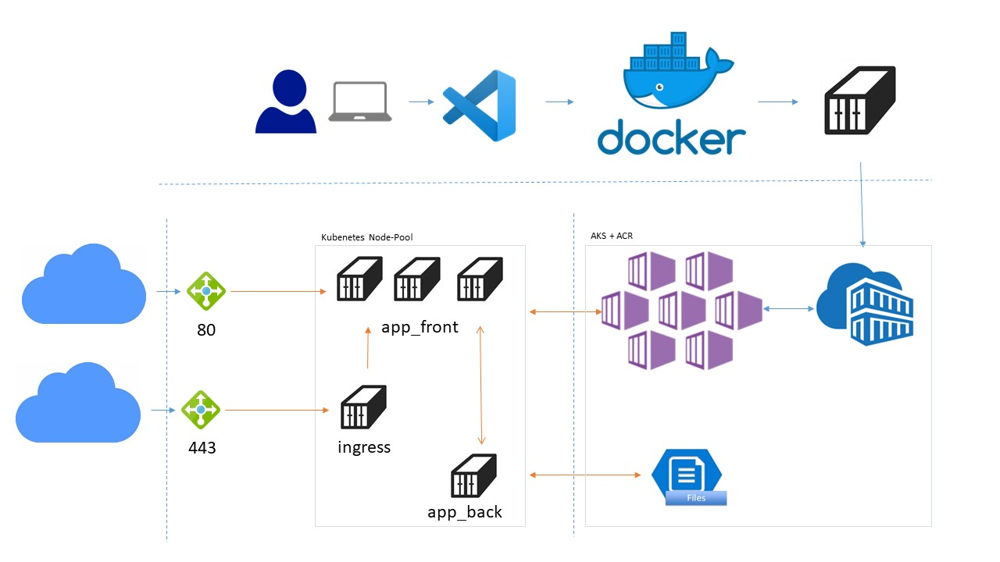

# Workshop: Azure Kubernetes Service

In this tutorial we will transfer a Web App from source into two Docker containers. One is the container with a database and the second one provides a website.
These containers will be uploaded into an Azure Container Registry (ACR) and then made available via Azure Kubernetes Service (AKS).
All steps are done in Ubuntu on WSL1 (Windows 10).

This demo is based on code from Microsoft, published at [Github Azure-Saples](https://github.com/Azure-Samples)

### Scheme of the finished app in AKS:

1. Public IP
2. Azure Load Balancer  
3. 3x Web- App instances (Nginx, in Phyton)
4. 1x MySQL Server
5. Persitent storage for MySQL DB
6. Ingress LB with Let's Encrypt



## Requirement

- Azure Subscription
- Docker for Windows
- WSL installed with Azure AZ, Docker and git (See /WSL for configuration of WSL1 with Docker / Azure CLI)

## Steps of this tutorial 

1. Container build locally. (Windows 10 with Docker for Windows)
2. Create ACR, AKS
3. Deploy App
4. https with ingress
5. Update Apps
6. AKS updates / upgrades
7. Remove all

### 1. Docker Conatainer

#### Clone this repo:
```BASH
mkdir /c/AKSDemo
cd /c/AKSDemo
git clone https://github.com/eichmeyer/AKSWorkshop.git
```
The folder ./App contains the sources of the two apps. The respective subfolders each contain a docker file that describes the corresponding app. 
There is a docker-compose.yaml which builds both apps as Docker images. Thus this setup can already be executed and tested locally.

#### Container build
```BASH
cd /AKSDemo/App
docker-compose up
# or without debug output
# docker-compose up -d
```
This fetches the base images and applies changes from dockerfile. When the containers start, we see the log output.
As described in docker-compose.yaml, the webapp is provided via port 8080. So the webapp can be opened in the browser via [http://localhost:8080](http://localhost:8080).

Stop and remove the container instances and resources
```BASH
cd /AKSDemo/App
docker-compose down
```
Remember, however, the database is persistent in the container. However, on AKS we want to store this outside. 
So we have successfully created the app on our client and therefore find our two images and the finished containers:
```BASH
harwee@006978575057:/c/AKS/App$ docker images
REPOSITORY                   TAG                 IMAGE ID            CREATED             SIZE
azure-vote-front             latest              c8431287964b        9 minutes ago       940MB
azure-vote-back              latest              f476354cb8f1        11 minutes ago      465MB
mysql                        latest              c8ad2be69a22        46 hours ago        465MB
tiangolo/uwsgi-nginx-flask   python2.7           04d91d0c6044        4 months ago        910MB
harwee@006978575057:/c/AKS/App$ docker container ls
CONTAINER ID        IMAGE               COMMAND                  CREATED             STATUS              PORTS                               NAMES
0c91bc2f5b97        azure-vote-front    "/entrypoint.sh /sta…"   9 minutes ago       Up 6 minutes        443/tcp, 0.0.0.0:8080->80/tcp       azure-vote-front
34169ce0f3f5        azure-vote-back     "docker-entrypoint.s…"   9 minutes ago       Up 6 minutes        0.0.0.0:3306->3306/tcp, 33060/tcp   azure-vote-back
harwee@006978575057:/c/AKS/App$
```
The images azure-vote-front and azure-vote-back will be uploaded to the ACR later. After that we don't need them locally anymore. 
#### A few more interesting docker commands for you:
```BASH
# Remove all conatiner
docker rm $(docker ps -a -q)

# Remove all images
docker rmi $(docker images -q)

# List running container
docker ps

# List all container
docker ps -a

# Enter a Docker container by name or ID and start a bash shell
docker exec -it 0c91bc2f5b97 bash
```
### 2. Setup AKC and AKS
#### Login and start

The following lines create all required components in region West Europe. If you change the resource group to another location, the persistent disk in Base.yaml must also be changed to this region. 
The names must be unique. Therefore please match / replace the following values: 
AKSDemoRG4711
AKSDemoACR4711
AKSDemoAKS4711
demo-aks-4711.eastus.cloudapp.azure.com


```BASH
# Login into Azure
az login

# List subscriptions
az account list --output table

# Change the active subscription
az account set --subscription <ID>

# Create a resource group
az group create --name AKSDemoRG4711 --location eastus
```
#### Creating ACS and upload images
```BASH
# Create an Azure Container Registry instance. Name must be unique.
az acr create --resource-group AKSDemoRG4711 --name AKSDemoACR4711 --sku Basic

# Log in to the container registry
az acr login --name AKSDemoACR4711

# get the login server address.  The adress looks like that aksdemoacr4711.azurecr.io
az acr list --resource-group AKSDemoRG4711 --query "[].{acrLoginServer:loginServer}" --output table

# Tag a container image
docker tag azure-vote-front aksdemoacr4711.azurecr.io/azure-vote-front:v1
docker tag azure-vote-back aksdemoacr4711.azurecr.io/azure-vote-back:v1

# List Images
harwee@006978575057:/c/AKS$ docker images
REPOSITORY                                   TAG                 IMAGE ID            CREATED             SIZE
aksdemoacr4711.azurecr.io/azure-vote-front   v1                  c8431287964b        2 hours ago         940MB
azure-vote-front                             latest              c8431287964b        2 hours ago         940MB
aksdemoacr4711.azurecr.io/azure-vote-back    v1                  f476354cb8f1        2 hours ago         465MB
azure-vote-back                              latest              f476354cb8f1        2 hours ago         465MB
mysql                                        latest              c8ad2be69a22        2 days ago          465MB
tiangolo/uwsgi-nginx-flask                   python2.7           04d91d0c6044        4 months ago        910MB

# Login and push images to registry
az acr login --name AKSDemoACR4711
docker push aksdemoacr4711.azurecr.io/azure-vote-front:v1
docker push aksdemoacr4711.azurecr.io/azure-vote-back:v1

# List images in registry
az acr repository list --name AKSDemoACR4711 --output table
az acr repository show-tags --name AKSDemoACR4711 --repository azure-vote-front --output table

```
#### Creating AKS
```BASH
# Get a fresh login. AAD App registration permission needed...
az login

# Create a Kubernetes cluster. enable-addons monitoring is optional and costs extra.
az aks create \
    --resource-group AKSDemoRG4711 \
    --name AKSDemoAKS4711 \
    --generate-ssh-keys \
    --vm-set-type AvailabilitySet \
    --node-vm-size Standard_B2ms \
    --node-count 3 \
    --nodepool-name nodepool1 \
    --load-balancer-sku basic \
    --enable-addons monitoring \
    --attach-acr AKSDemoACR4711

# scale (optional)
az aks scale \
    --resource-group AKSDemoRG4711 \
    --name AKSDemoAKS4711 \
    --node-count 2 \
    --nodepool-name nodepool1

# Install the Kubernetes CLI
sudo az aks install-cli

# Connect to cluster using kubectl
az aks get-credentials --resource-group AKSDemoRG4711 --name AKSDemoAKS4711

# Test
kubectl get nodes
```
#### Start the Kubernetes dashboard
Preferably in a new terminal
```BASH
# Get a fresh login
az login

# If your AKS cluster uses RBAC, a ClusterRoleBinding must be created before you can access the dashboard
kubectl create clusterrolebinding kubernetes-dashboard --clusterrole=cluster-admin --serviceaccount=kube-system:kubernetes-dashboard

# create a proxy between your development system and the Kubernetes API
az aks browse --resource-group AKSDemoRG4711 --name AKSDemoAKS4711
```
If not performed automatically, gotto [http://127.0.0.1:8001](http://127.0.0.1:8001)
### 3. Deploy app
In these tutorials, an Azure Container Registry (ACR) instance keeps the container images for the sample application. To deploy the application, you must update the image name in the Kubernetes manifest file to include your ACR login server name. My yaml use the V1 from steps before. So I change in app_back.yaml and app_front.yaml the containers part to this image: 

app_front.yaml
```YAML
...
containers:
- name: azure-vote-front
  image: aksdemoacr4711.azurecr.io/azure-vote-front:v1
...
```
app_back.yaml
```YAML
...
containers:
- name: azure-vote-back
  image: aksdemoacr4711.azurecr.io/azure-vote-back:v1
...
```
This app is based on different components. The Base provides the secrets and the persistent disk for the database. Then follow the apps and the load balancer.

Deploy:
```BASH
# deploy secrets and the persistent disk
kubectl apply -f AKS/base.yaml

# deploy Apps
kubectl apply -f AKS/app_back.yaml
kubectl apply -f AKS/app_front.yaml

# deploy LoadBlancer
kubectl apply -f AKS/AzureLB.yaml

# Or all files in folder 
# kubectl apply -f AKS/.

# monitor progress and get public IP
kubectl get service azure-vote-front
```
As soon as the external address is displayed, the application can be reached via this IP. However, it may take a few minutes before the routing really works.

### 4. https with ingress 

This part uses Helm to install the NGINX ingress controller and cert-manager.
Helm is a "package manager" for Kubernetes. More info: [helm.se](https://helm.se)
Please install Helm first:
```BASH
curl -fsSL -o get_helm.sh https://raw.githubusercontent.com/helm/helm/master/scripts/get-helm-3
$ chmod 700 get_helm.sh
$ ./get_helm.sh
```
#### Create NGINX ingress controller
```BASH
# Create a namespace for your ingress resources
kubectl create namespace ingress-basic

# Add the official stable repo
helm repo add stable https://kubernetes-charts.storage.googleapis.com/

# Use Helm to deploy an NGINX ingress controller
helm install nginx stable/nginx-ingress \
    --namespace ingress-basic \
    --set controller.replicaCount=2 \
    --set controller.nodeSelector."beta\.kubernetes\.io/os"=linux \
    --set defaultBackend.nodeSelector."beta\.kubernetes\.io/os"=linux

# Get public IP -> Needed for DNS Name!
kubectl get service -l app=nginx-ingress --namespace ingress-basic
```
Get DNS Name:
```BASH
# Public IP address of your ingress controller. See before...
IP="52.170.234.200"

# Name to associate with public IP address
DNSNAME="demo-aks-4711"

# Get the resource-id of the public ip
PUBLICIPID=$(az network public-ip list --query "[?ipAddress!=null]|[?contains(ipAddress, '$IP')].[id]" --output tsv)

# Update public ip address with DNS name
az network public-ip update --ids $PUBLICIPID --dns-name $DNSNAME

# Display the FQDN -> Needed to change in app_front_ingress.yaml
az network public-ip show --ids $PUBLICIPID --query "[dnsSettings.fqdn]" --output tsv
```
#### Install cert-manager
The NGINX ingress controller supports TLS termination. This step demonstrates using cert-manager, which provides automatic Lets Encrypt certificate generation and management functionality.

```BASH
# Install the CustomResourceDefinition resources separately
kubectl apply --validate=false \
              -f https://raw.githubusercontent.com/jetstack/cert-manager/release-0.12/deploy/manifests/00-crds.yaml \
              --namespace ingress-basic

# Label the ingress-basic namespace to disable resource validation
kubectl label namespace ingress-basic certmanager.k8s.io/disable-validation=true

# Add the Jetstack Helm repository
helm repo add jetstack https://charts.jetstack.io

# Update your local Helm chart repository cache
helm repo update

# Install the cert-manager Helm chart
helm install cert-manager \
     --namespace ingress-basic \
     --version v0.12 jetstack/cert-manager \
     --set ingressShim.defaultIssuerName=letsencrypt \
     --set ingressShim.defaultIssuerKind=ClusterIssuer
```
#### Create a CA cluster issuer and ingress route
```BASH
# Create a CA cluster 
kubectl apply -f AKSIngress/cluster-issuer.yaml --namespace ingress-basic

# Create an ingress route. Update FQNs to yours!
kubectl apply -f AKSIngress/app_front_ingress.yaml --namespace ingress-basic

# Verify a certificate object has been created
kubectl get certificate --namespace ingress-basic
kubectl describe certificate tls-secret --namespace ingress-basic

# Change first LB to internal
kubectl delete -f AKS/AzureLB.yaml
kubectl apply -f AKSIngress/AzureLB.yaml

````

### 5. App update
Finally we want to roll out an update to our running environment. For this we edit the file 
./App/azure-vote/azure-vote/config_file.cfg
```
TITLE = 'Azure Voting App'
VOTE1VALUE = 'Car'
VOTE2VALUE = 'Train'
SHOWHOST = 'false'
```
No we rebuild the images, tag and upload the new azure-vote-front build:
```BASH
# Rbuild images
cd /c/AKS/App
docker-compose build

# Tag image
docker tag azure-vote-front aksdemoacr4711.azurecr.io/azure-vote-front:v2

# Upload
az login
az acr login --name AKSDemoACR4711
docker push aksdemoacr4711.azurecr.io/azure-vote-front:v2
```
Update app_front.yaml to use the new version:

app_front.yaml
```YAML
...
containers:
- name: azure-vote-front
  image: aksdemoacr4711.azurecr.io/azure-vote-front:v2
...
```

```BASH
# Get a fresh login
az login

# Connect to cluster using kubectl
az aks get-credentials --resource-group AKSDemoRG4711 --name AKSDemoAKS4711

# Update deployment
cd /c/AKS/AKS
kubectl apply -f app_front.yaml
```
### 6. AKS updates / upgrades

#### AKS Node updates

In an AKS cluster, your Kubernetes nodes run as Azure virtual machines (VMs). These Linux-based VMs use an Ubuntu image, with the OS configured to automatically check for updates every night. If security or kernel updates are available, they are automatically downloaded and installed. Some security updates, such as kernel updates, require a node reboot to finalize the process. A Linux node that requires a reboot creates a file named /var/run/reboot-required. This reboot process doesn't happen automatically.

You can use your own workflows and processes to handle node reboots, or use kured to orchestrate the process. With kured, a DaemonSet is deployed that runs a pod on each Linux node in the cluster. These pods in the DaemonSet watch for existence of the /var/run/reboot-required file, and then initiate a process to reboot the nodes.

```BASH
# deploy the kured DaemonSet
kubectl apply -f kured-1.2.0-dockerhub.yaml
```

#### AKS upgrade
```BASH
# Check for available AKS cluster upgrades
az aks get-upgrades \
    --resource-group AKSDemoRG4711 \
    --name AKSDemoAKS4711 \
    --output table

# following example upgrades a cluster to version 1.13.10
az aks upgrade \
    --resource-group AKSDemoRG4711 \
    --name AKSDemoAKS4711 \
    --kubernetes-version 1.13.10

# To confirm that the upgrade was successful
az aks show \
    --resource-group AKSDemoRG4711 \
    --name AKSDemoAKS4711 \
    --output table
```
### 7. Remove all

```BASH
# Delete AKS
az aks delete \
    --resource-group AKSDemoRG4711 \
    --name AKSDemoAKS4711

# Delete ACR
az acr delete \
    --resource-group AKSDemoRG4711 \
    --name AKSDemoAKS4711

# Delete resource group
az group delete --name AKSDemoRG4711

# Remove all conatiner
docker --force rm $(docker ps -a -q)

# Remove all images
docker --force rmi $(docker images -q)
```
And remove the Enterprise application 'AKSDemoAKS4711' from azure AD.


Copyright (c) 2020 H. Eichmeyer


